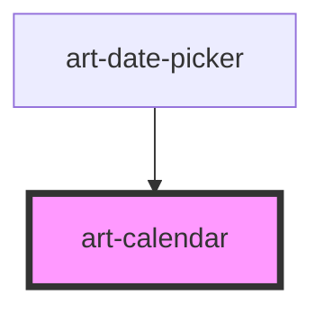

# art-calendar

<!-- Auto Generated Below -->

## Overview

Calendar — shadcn/ui parity (react-day-picker look): a month grid with previous / next
navigation or month + year dropdowns, single, multiple or range selection, min / max and
custom disabled days, several months side by side, locale-aware weekday names and first
day of the week. Dates cross the API as ISO strings; `change` also carries `Date` objects.
Form-associated so it can sit inline in a form.

## Properties

| Property             | Attribute           | Description                                                                                         | Type                                     | Default     |
| -------------------- | ------------------- | --------------------------------------------------------------------------------------------------- | ---------------------------------------- | ----------- |
| `captionLayout`      | `caption-layout`    | `label` shows "September 2026" with arrows; `dropdown` adds month and year selects (date of birth). | `"dropdown" \| "label"`                  | `'label'`   |
| `disabled`           | `disabled`          |                                                                                                     | `boolean`                                | `false`     |
| `disabledDates`      | --                  | Return true for a day that cannot be selected (weekends, booked dates…).                            | `((date: Date) => boolean) \| undefined` | `undefined` |
| `fixedWeeks`         | `fixed-weeks`       | Always render six weeks so the height never changes.                                                | `boolean`                                | `false`     |
| `hostAriaLabel`      | `aria-label`        |                                                                                                     | `null \| string \| undefined`            | `undefined` |
| `hostAriaLabelledby` | `aria-labelledby`   |                                                                                                     | `null \| string \| undefined`            | `undefined` |
| `locale`             | `locale`            | BCP 47 tag for names and the first day of the week; defaults to the document language.              | `string \| undefined`                    | `undefined` |
| `max`                | `max`               |                                                                                                     | `string \| undefined`                    | `undefined` |
| `min`                | `min`               | Earliest / latest selectable day (`YYYY-MM-DD`).                                                    | `string \| undefined`                    | `undefined` |
| `mode`               | `mode`              | Selection mode.                                                                                     | `"multiple" \| "range" \| "single"`      | `'single'`  |
| `month`              | `month`             | Displayed month (`YYYY-MM`); follows the selection, then today.                                     | `string \| undefined`                    | `undefined` |
| `name`               | `name`              |                                                                                                     | `string \| undefined`                    | `undefined` |
| `numberOfMonths`     | `number-of-months`  | Months shown side by side (ranges usually show two).                                                | `number`                                 | `1`         |
| `required`           | `required`          | Clicking the selected day keeps it selected instead of clearing (single mode).                      | `boolean`                                | `false`     |
| `showOutsideDays`    | `show-outside-days` | Fill the first and last rows with the neighbouring months' days.                                    | `boolean`                                | `true`      |
| `value`              | `value`             | Selected day(s): `YYYY-MM-DD`; comma-separated for `multiple`; `start/end` for `range`.             | `string`                                 | `''`        |
| `weekStartsOn`       | `week-starts-on`    | 0 = Sunday … 6 = Saturday; overrides the locale's first day.                                        | `number \| undefined`                    | `undefined` |

## Events

| Event          | Description                                                            | Type                                |
| -------------- | ---------------------------------------------------------------------- | ----------------------------------- |
| `change`       | Emitted when the selection changes.                                    | `CustomEvent<CalendarChangeDetail>` |
| `month-change` | Emitted when the displayed month changes; `detail.month` is `YYYY-MM`. | `CustomEvent<{ month: string; }>`   |

## Methods

### `setFocus() => Promise<void>`

Move keyboard focus onto the calendar (the selected day, else today, else the 1st).

#### Returns

Type: `Promise<void>`

## Shadow Parts

| Part         | Description                  |
| ------------ | ---------------------------- |
| `"calendar"` | The outer box.               |
| `"caption"`  | The month heading row.       |
| `"day"`      | A day button.                |
| `"grid"`     | The `<table role="grid">`.   |
| `"month"`    | One month (caption + grid).  |
| `"nav"`      | The previous / next buttons. |

## Dependencies

### Used by

 - [art-date-picker](../date-picker)

### Graph

----------------------------------------------

*Built with [StencilJS](https://stenciljs.com/)*
