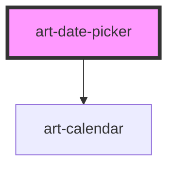

# art-date-picker

<!-- Auto Generated Below -->

## Overview

Date Picker — shadcn/ui parity: a field-height trigger showing the chosen date (or range)
that opens a Calendar in a popover on the platform top layer. Single day or range;
form-associated with an ISO `value`.

## Properties

| Property              | Attribute          | Description                                                                   | Type                                                                                                                                                                 | Default          |
| --------------------- | ------------------ | ----------------------------------------------------------------------------- | -------------------------------------------------------------------------------------------------------------------------------------------------------------------- | ---------------- |
| `captionLayout`       | `caption-layout`   | Month and year dropdowns in the calendar caption (date of birth).             | `"dropdown" \| "label"`                                                                                                                                              | `'label'`        |
| `disabled`            | `disabled`         |                                                                               | `boolean`                                                                                                                                                            | `false`          |
| `disabledDates`       | --                 | Passed to the calendar: return true for a day that cannot be selected.        | `((date: Date) => boolean) \| undefined`                                                                                                                             | `undefined`      |
| `format`              | `format`           | How the chosen date reads in the trigger (`Intl.DateTimeFormat` `dateStyle`). | `"full" \| "long" \| "medium" \| "short"`                                                                                                                            | `'long'`         |
| `hostAriaDescribedby` | `aria-describedby` |                                                                               | `null \| string \| undefined`                                                                                                                                        | `undefined`      |
| `hostAriaLabel`       | `aria-label`       |                                                                               | `null \| string \| undefined`                                                                                                                                        | `undefined`      |
| `hostAriaLabelledby`  | `aria-labelledby`  |                                                                               | `null \| string \| undefined`                                                                                                                                        | `undefined`      |
| `invalid`             | `invalid`          |                                                                               | `boolean`                                                                                                                                                            | `false`          |
| `locale`              | `locale`           |                                                                               | `string \| undefined`                                                                                                                                                | `undefined`      |
| `max`                 | `max`              |                                                                               | `string \| undefined`                                                                                                                                                | `undefined`      |
| `min`                 | `min`              | Earliest / latest selectable day.                                             | `string \| undefined`                                                                                                                                                | `undefined`      |
| `mode`                | `mode`             | `single` (a day) or `range` (`start/end`).                                    | `"range" \| "single"`                                                                                                                                                | `'single'`       |
| `name`                | `name`             |                                                                               | `string \| undefined`                                                                                                                                                | `undefined`      |
| `numberOfMonths`      | `number-of-months` | Months shown side by side; ranges default to two.                             | `number \| undefined`                                                                                                                                                | `undefined`      |
| `open`                | `open`             |                                                                               | `boolean`                                                                                                                                                            | `false`          |
| `placeholder`         | `placeholder`      |                                                                               | `string`                                                                                                                                                             | `'Pick a date'`  |
| `placement`           | `placement`        |                                                                               | `"bottom" \| "bottom-end" \| "bottom-start" \| "left" \| "left-end" \| "left-start" \| "right" \| "right-end" \| "right-start" \| "top" \| "top-end" \| "top-start"` | `'bottom-start'` |
| `required`            | `required`         |                                                                               | `boolean`                                                                                                                                                            | `false`          |
| `size`                | `size`             |                                                                               | `"lg" \| "md" \| "sm"`                                                                                                                                               | `'md'`           |
| `value`               | `value`            | `YYYY-MM-DD`, or `start/end` for a range.                                     | `string`                                                                                                                                                             | `''`             |

## Events

| Event         | Description                                                                       | Type                                |
| ------------- | --------------------------------------------------------------------------------- | ----------------------------------- |
| `change`      | Emitted when the date (or range) changes; same detail as the calendar's `change`. | `CustomEvent<CalendarChangeDetail>` |
| `open-change` |                                                                                   | `CustomEvent<{ open: boolean; }>`   |

## Methods

### `setFocus() => Promise<void>`

Focus the trigger.

#### Returns

Type: `Promise<void>`

## Shadow Parts

| Part        | Description                                         |
| ----------- | --------------------------------------------------- |
| `"content"` | The popover (`role="dialog"`) holding the calendar. |
| `"trigger"` | The `<button>` that opens the picker.               |
| `"value"`   |                                                     |

## Dependencies

### Depends on

- [art-calendar](../calendar)

### Graph

----------------------------------------------

*Built with [StencilJS](https://stenciljs.com/)*
