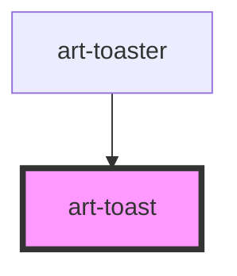

# art-toast

<!-- Auto Generated Below -->

## Overview

Toast — one notification, shadcn/ui (Sonner) parity: an icon per variant, a title, a
description, optional action / cancel buttons and a close button. Auto-dismisses after
`duration` (paused while hovered or focused), then plays the exit motion and emits `dismiss`.
Usually created by `<art-toaster>` from `toast()`; can also be written declaratively.

## Properties

| Property      | Attribute      | Description                                                                                | Type                                                                    | Default     |
| ------------- | -------------- | ------------------------------------------------------------------------------------------ | ----------------------------------------------------------------------- | ----------- |
| `actionLabel` | `action-label` | Action / cancel button labels (imperative use); the `action` slot is the declarative form. | `string \| undefined`                                                   | `undefined` |
| `cancelLabel` | `cancel-label` |                                                                                            | `string \| undefined`                                                   | `undefined` |
| `closeButton` | `close-button` | Show the close button.                                                                     | `boolean`                                                               | `false`     |
| `description` | `description`  | Description text (alternative to the `description` slot).                                  | `string \| undefined`                                                   | `undefined` |
| `duration`    | `duration`     | ms before auto-dismiss; `0` or `Infinity` keeps the toast (loading toasts always stay).    | `number`                                                                | `4000`      |
| `label`       | `label`        | Title text (alternative to the default slot).                                              | `string \| undefined`                                                   | `undefined` |
| `richColors`  | `rich-colors`  | Coloured backgrounds per variant (Sonner `richColors`).                                    | `boolean`                                                               | `false`     |
| `variant`     | `variant`      |                                                                                            | `"default" \| "error" \| "info" \| "loading" \| "success" \| "warning"` | `'default'` |

## Events

| Event     | Description                                               | Type                                           |
| --------- | --------------------------------------------------------- | ---------------------------------------------- |
| `action`  | The action button was pressed (the toast then dismisses). | `CustomEvent<void>`                            |
| `cancel`  | The cancel button was pressed (the toast then dismisses). | `CustomEvent<void>`                            |
| `dismiss` | Emitted after the exit motion; `detail.reason`.           | `CustomEvent<{ reason: ToastDismissReason; }>` |

## Methods

### `close(reason?: ToastDismissReason) => Promise<void>`

Close now: plays the exit motion, then emits `dismiss`. (`dismiss` is the event's name.)

#### Parameters

| Name     | Type                                                             | Description |
| -------- | ---------------------------------------------------------------- | ----------- |
| `reason` | `"cancel" \| "close" \| "timeout" \| "action" \| "programmatic"` |             |

#### Returns

Type: `Promise<void>`

### `restart() => Promise<void>`

Restart the auto-dismiss timer (the toaster calls it when a toast is updated).

#### Returns

Type: `Promise<void>`

## Slots

| Slot            | Description                                    |
| --------------- | ---------------------------------------------- |
|                 | The title.                                     |
| `"action"`      | Buttons at the end (`<art-button size="sm">`). |
| `"description"` | Secondary text.                                |
| `"icon"`        | Replaces the variant icon.                     |

## Shadow Parts

| Part      | Description       |
| --------- | ----------------- |
| `"close"` | The close button. |
| `"toast"` | The card.         |

## Dependencies

### Used by

 - [art-toaster](../toaster)

### Graph

----------------------------------------------

*Built with [StencilJS](https://stenciljs.com/)*
