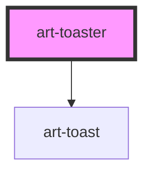

# art-toaster

<!-- Auto Generated Below -->

## Overview

Toaster — shadcn/ui (Sonner) parity: the region that shows toasts. Put one on the page and
call `toast('Saved')` / `toast.success(…)` / `toast.promise(…)` (exported from
`@aranghat/components`) anywhere; `<art-toast>` children work declaratively too.
Fixed in a corner on the platform top layer (above later overlays) unless `inline`.

## Properties

| Property        | Attribute        | Description                                                                      | Type                                                                                              | Default           |
| --------------- | ---------------- | -------------------------------------------------------------------------------- | ------------------------------------------------------------------------------------------------- | ----------------- |
| `closeButton`   | `close-button`   | Close button on every toast.                                                     | `boolean`                                                                                         | `false`           |
| `duration`      | `duration`       | Default auto-dismiss (ms) for toasts that do not set their own.                  | `number`                                                                                          | `4000`            |
| `inline`        | `inline`         | Render in the page flow instead of a fixed corner (docs, previews).              | `boolean`                                                                                         | `false`           |
| `label`         | `label`          | Accessible name of the region.                                                   | `string`                                                                                          | `'Notifications'` |
| `position`      | `position`       |                                                                                  | `"bottom-center" \| "bottom-left" \| "bottom-right" \| "top-center" \| "top-left" \| "top-right"` | `'bottom-right'`  |
| `richColors`    | `rich-colors`    | Coloured backgrounds per variant.                                                | `boolean`                                                                                         | `false`           |
| `visibleToasts` | `visible-toasts` | Newest toasts show; older ones beyond this count are hidden until there is room. | `number`                                                                                          | `3`               |

## Slots

| Slot | Description                 |
| ---- | --------------------------- |
|      | Declarative `<art-toast>`s. |

## Shadow Parts

| Part       | Description              |
| ---------- | ------------------------ |
| `"region"` | The `role="region"` box. |

## Dependencies

### Depends on

- [art-toast](../toast)

### Graph

----------------------------------------------

*Built with [StencilJS](https://stenciljs.com/)*
